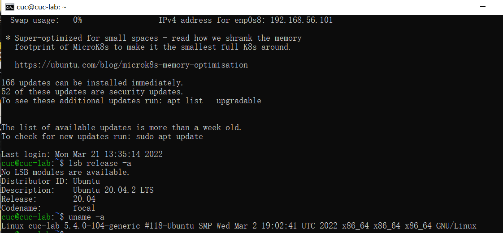
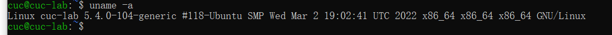
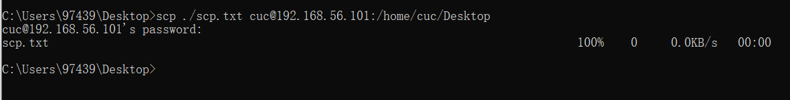
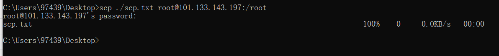
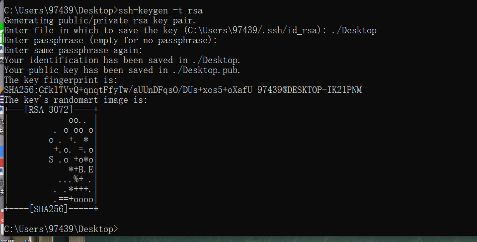
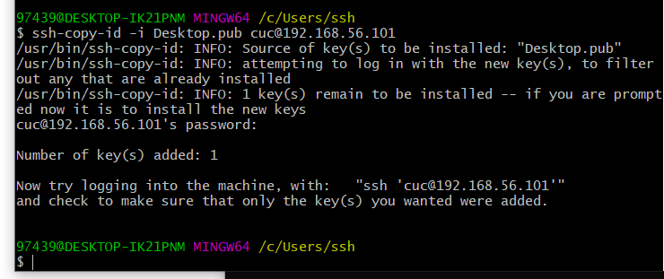
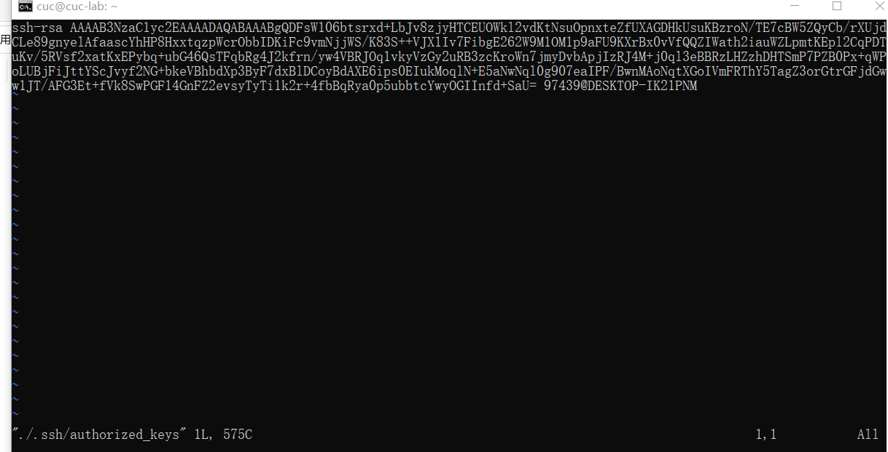

# linux实验一

### 当前linux发行版基本信息

```
lsb_release -a
```



### 当前linux内核版本信息

```
uname -a
```
 

### Virtualbox安装完 Ubuntu 之后新添加的网卡实现系统开机自动启用和自动获取 IP

```
ip a
```


查看了解到两张网卡均在工作中

### 使用scp在「虚拟机和宿主机之间」、「本机和远程 Linux 系统之间」传输文件

首先在桌面创建测试文本

#### 虚拟机和宿主机之间

```
scp ./scp.txt cuc@192.168.56.101:/home/cuc/Desktop
```

#### 本机和远程linux系统之间

```
scp ./scp.txt root@101.133.143.197:/root
```

 
### 配置 SSH 免密登录

```
ssh-keygen -t rsa
```

在宿主机上生成公私钥



```
$ ssh-copy-id -i Desktop.pub cuc@192.168.56.101
```

将公钥上传到虚拟机中



```
vim ./.ssh/authorized_keys
```

检查是否成功



### 遇到的问题

gitclone时始终出错，重新创立公私钥后才得以成功克隆仓库

### 参考资料

[GitHub如何配置SSH Key](https://blog.csdn.net/u013778905/article/details/83501204)

