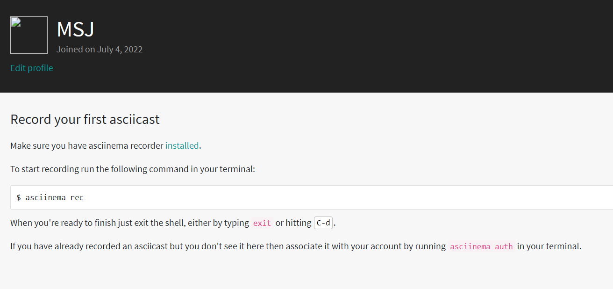
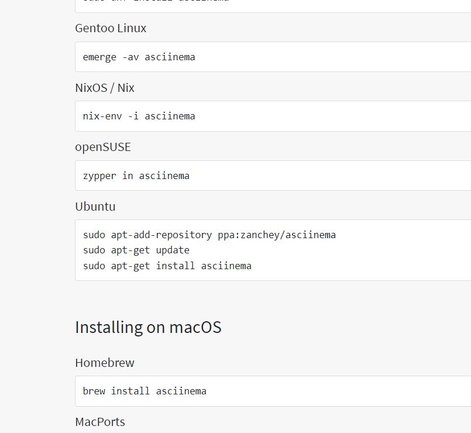
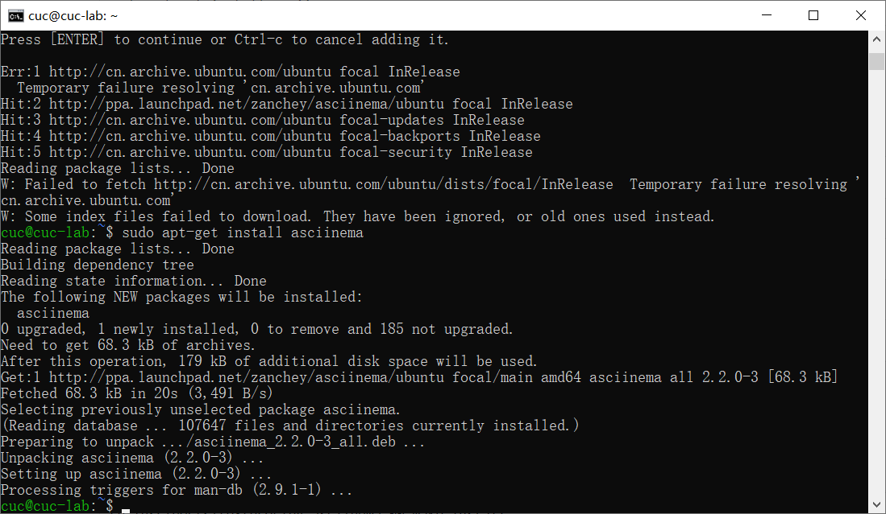
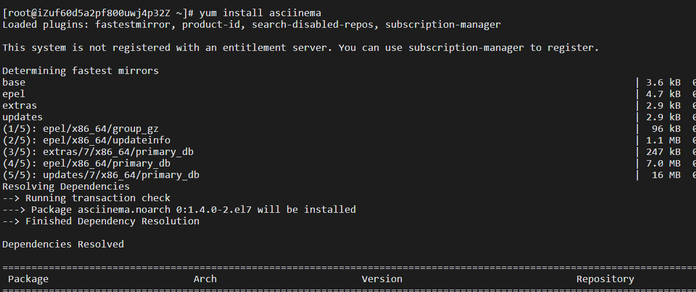

## H2

### 实验环境

注册asciinema账号



根据asciinema网站教学本地机安装asciinema

```
sudo apt-add-repository ppa:zanchey/asciinema
sudo apt-get update
sudo apt-get install asciinema
```





CentOS版安装asciinema

```
yum install asciinema
```



获取链接

```
asciinema auth
```

### 实验视频

#### 实验准备

- 本地版本

安装zip

```
sudo apt install zip
```

安装tar

```
sudo apt install tar
```

安装7z

```
sudo apt-get install p7zip
```

安装rar和unrar

```
sudo apt install rar
sudo apt install unrar
```

- CentOS版本

安装bzip2

```
yum -y install bzip2
```

安装zip

```
yum install -y unzip zip
```

安装7z

```
sudo yum install p7zip
```

安装rar和unrar

```
wget --no-check-certificate https://www.rarlab.com/rar/rarlinux-x64-5.9.1.tar.gz
tar -zxvf rarlinux-x64-5.9.1.tar.gz
cd rar
sudo cp -v rar unrar /usr/local/bin/
sudo apt install unrar
```


|              | 本地版本                                          | CentOS版本                                        |
| ------------ | ------------------------------------------------- | ------------------------------------------------- |
| 软件包管理   | https://asciinema.org/a/vI8S04MvvrYm4Q2Q1fcLWZjll | https://asciinema.org/a/she4GNouOL5v97SNLP9c9WBJg |
| 文件管理     | https://asciinema.org/a/W1vWpNF6IFU5elnLafiDthn31 | https://asciinema.org/a/sNdzCsqHjL2KeiXJWAJBOvKjc |
| 文件解压缩   | https://asciinema.org/a/L4x23T4g0tYKV5wIavSMU9PSU | https://asciinema.org/a/pq2jTYjsbl2ZujctdkyQfXldP |
| 子进程管理   | https://asciinema.org/a/9E8olEChQdYhbDrdgbJq7ARDb | https://asciinema.org/a/tX1aIV5QjlPSEBxTd98frpJVt |
| 硬盘信息获取 | https://asciinema.org/a/n9xWiDdyMvlugH9RKIZ2CKI0I | https://asciinema.org/a/VZjXGeqNBSuEr6U9SjWQ1FXcN |

### 实验遇到的问题

1.ctrl+c无法终止ping命令

2.CentOS版本安装rar和unrar遇到困难

### 参考资料

1.[ctrl c无法结束命令linux](https://www.csdn.net/tags/MtzakgzsODIzMzgtYmxvZwO0O0OO0O0O.html)

2.[如何在虚拟机上解压rar压缩文件](https://blog.csdn.net/m0_46517444/article/details/119376390)
