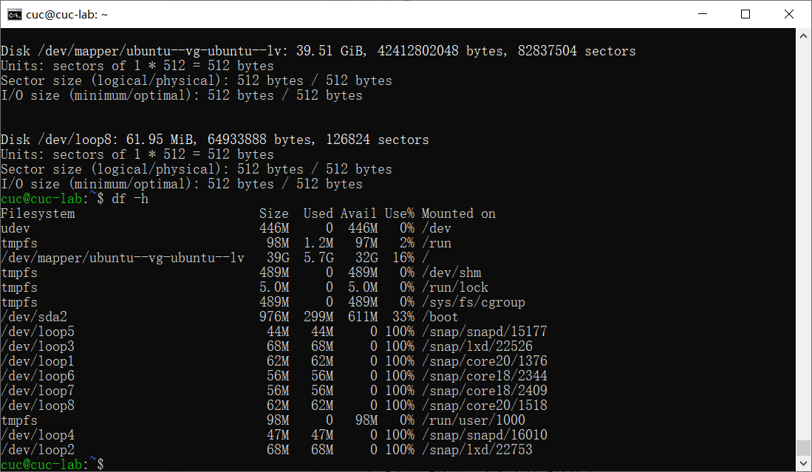

# H3

## 实验过程

### Systemd跟练

#### 系统管理

```
# 查看启动耗时
$ systemd-analyze                                                                                       

# 查看每个服务的启动耗时
$ systemd-analyze blame

# 显示瀑布状的启动过程流
$ systemd-analyze critical-chain

# 显示指定服务的启动流
$ systemd-analyze critical-chain atd.service

# 显示当前主机的信息
$ hostnamectl

# 设置主机名。
$ sudo hostnamectl set-hostname cuc-ou

# 查看本地化设置
$ localectl

# 设置本地化参数。
$ sudo localectl set-locale LANG=en_GB.utf8
$ sudo localectl set-keymap en_GB

# 查看当前时区设置
$ timedatectl

# 显示所有可用的时区
$ timedatectl list-timezones                                                                                   

# 设置当前时区
$ sudo timedatectl set-timezone Asia/Hong_Kong
$ sudo timedatectl set-time YYYY-MM-DD
$ sudo timedatectl set-time HH:MM:SS

# 列出当前session
$ loginctl list-sessions

# 列出当前登录用户
$ loginctl list-users

# 列出显示指定用户的信息
$ loginctl show-user cuc
```

[asciinema录屏](https://asciinema.org/a/8m2fcJScuYmhHLcXedUzgzuLo)

#### unit

```
# 列出正在运行的 Unit
$ systemctl list-units

# 列出所有Unit，包括没有找到配置文件的或者启动失败的
$ systemctl list-units --all

# 列出所有没有运行的 Unit
$ systemctl list-units --all --state=inactive

# 列出所有加载失败的 Unit
$ systemctl list-units --failed

# 列出所有正在运行的、类型为 service 的 Unit
$ systemctl list-units --type=service

# 显示系统状态
$ systemctl status

# 显示单个 Unit 的状态
$ sysystemctl status ssh.service

# 显示某个 Unit 是否正在运行
$ systemctl is-active ssh.service

# 显示某个 Unit 是否处于启动失败状态
$ systemctl is-failed ssh.service

# 显示某个 Unit 服务是否建立了启动链接
$ systemctl is-enabled ssh.service

# 立即启动一个服务
$ sudo systemctl start ssh.service
$ systemctl is-active ssh.service

# 立即停止一个服务
$ sudo systemctl stop ssh.service

# 重启一个服务
$ sudo systemctl restart ssh.service

# 杀死一个服务的所有子进程
$ sudo systemctl kill ssh.service

# 重新加载一个服务的配置文件
$ sudo systemctl reload apache.service

# 重载所有修改过的配置文件
$ sudo systemctl daemon-reload

# 显示某个 Unit 的所有底层参数
$ systemctl show atd.service

# 显示某个 Unit 的指定属性的值
$ systemctl show -p CPUShares atd.service

# 设置某个 Unit 的指定属性
$ sudo systemctl set-property atd.service CPUShares=500

$ systemctl list-dependencies nginx.service

$ systemctl list-dependencies --all nginx.service

```

[asciinema录屏](https://asciinema.org/a/y5GLF1CmLBsUqNCOIvIdm6l2o)

#### unit配置文件

```
$ sudo systemctl enable ssh.service

$ sudo systemctl disable ssh.service

# 列出所有配置文件
$ systemctl list-unit-files

# 列出指定类型的配置文件
$ systemctl list-unit-files --type=service

$ systemctl status ssh.service

$ sudo systemctl daemon-reload
$ sudo systemctl restart atd.service

$ systemctl cat atd.service
```

[asciinema录屏](https://asciinema.org/a/9J6LvoctlP6gjFtJo5XFls3OV)

Target

```
# 查看当前系统的所有 Target
$ systemctl list-unit-files --type=target

# 查看一个 Target 包含的所有 Unit
$ systemctl list-dependencies multi-user.target

# 查看启动时的默认 Target
$ systemctl get-default

# 设置启动时的默认 Target
$ sudo systemctl set-default multi-user.target

# 切换 Target 时，默认不关闭前一个 Target 启动的进程，
# systemctl isolate 命令改变这种行为，
# 关闭前一个 Target 里面所有不属于后一个 Target 的进程
$ sudo systemctl isolate multi-user.target
$ systemctl list-unit-files --type=targetcl
```

[asciinema录屏](https://asciinema.org/a/IxOFUYZYvqVTLKivqDalea0yQ)

#### 日志管理

```
# 查看所有日志（默认情况下 ，只保存本次启动的日志）
$ sudo journalctl

# 查看内核日志（不显示应用日志）
$ sudo journalctl -k

# 查看系统本次启动的日志
$ sudo journalctl -b
$ sudo journalctl -b -0

# 查看上一次启动的日志（需更改设置）
$ sudo journalctl -b -1

# 查看指定时间的日志
$ sudo journalctl --since "20 min ago"
$ sudo journalctl --since yesterday

# 显示尾部的最新10行日志
$ sudo journalctl -n

# 显示尾部指定行数的日志
$ sudo journalctl -n 20

# 实时滚动显示最新日志
$ sudo journalctl -f

# 查看指定服务的日志
$ sudo journalctl /usr/lib/systemd/systemd

# 查看指定进程的日志
$ sudo journalctl _PID=1

# 查看某个路径的脚本的日志
$ sudo journalctl /usr/bin/bash

# 查看指定用户的日志
$ sudo journalctl _UID=33 --since today

# 查看某个 Unit 的日志
$ sudo journalctl -u nginx.service
$ sudo journalctl -u nginx.service --since today

# 实时滚动显示某个 Unit 的最新日志
$ sudo journalctl -u nginx.service -f

# 合并显示多个 Unit 的日志
$ journalctl -u nginx.service -u php-fpm.service --since today

# 查看指定优先级（及其以上级别）的日志，共有8级
# 0: emerg
# 1: alert
# 2: crit
# 3: err
# 4: warning
# 5: notice
# 6: info
# 7: debug
$ sudo journalctl -p err -b

# 日志默认分页输出，--no-pager 改为正常的标准输出
$ sudo journalctl --no-pager

# 以 JSON 格式（单行）输出
$ sudo journalctl -b -u nginx.service -o json

# 以 JSON 格式（多行）输出，可读性更好
$ sudo journalctl -b -u nginx.serviceqq
 -o json-pretty

# 显示日志占据的硬盘空间
$ sudo journalctl --disk-usage

# 指定日志文件占据的最大空间
$ sudo journalctl --vacuum-size=1G

# 指定日志文件保存多久
$ sudo journalctl --vacuum-time=1years

```

[asciinema录屏](https://asciinema.org/a/Giysp4HE7wmiG0UVg583dgo1q)

#### 实战

```
$ sudo systemctl enable ssh

$ sudo systemctl start ssh

$ sudo systemctl stop ssh.service

$ systemctl is-active ssh.service

$ sudo systemctl kill ssh.service

$ sudo systemctl restart ssh.service

$ systemctl cat ssh.service

$ systemctl get-default

$ systemctl list-dependencies multi-user.target

$ systemctl cat multi-user.target

$ sudo systemctl daemon-reload

$ sudo systemctl restart ssh
```

[asciinema录屏](https://asciinema.org/a/dgSX6Wbje5RMDFKwKEpvil1Z9)

#### 添加用户并使其具备sudo执行程序权限

```
sudo adduser user

sudo usermod -G sudo user

getent group sudo
```


#### 将用户添加到用户组

```
sudo addgroup group_1

sudo usermod -a -G group_1 user

groups user
```


￥查看当前系统分区表和文件系统信息

```
sudo fdisk -l

df -h
```




#### 开机时自动挂载Virtualbox共享目录分区

```
sudo mount -t vboxsf sharefile /mnt/share

sudo vim /etc/fstab
```

创立文件并在虚拟机中设置


在虚拟机中挂载


成功实现开机自动挂载


#### 基于LVM的分区实现动态扩容和缩减容量

```
##创建PV物理卷
pvcreate /dev/sda2

umount /dev/sda2

##创建逻辑卷
lvcreate -l 2000 -n lv_test ubuntu-vg

##创建ext3文件系统
mkfs -t ext3 /dev/ubuntu-vg/lv_test

##把所有剩余空间全部增加给逻辑卷
lvextend -l +8111 /dev/ubuntu-vg/lv_test

##修改文件系统大小
resize2fs /dev/ubuntu-vg/lv_test

umount /dev/ubuntu-vg/lv_test
```

创建PV物理卷


创建逻辑卷


扩容


#### 如何通过 systemd 设置实现在网络连通时运行一个指定脚本，在网络断开时运行另一个脚本？

```
systemctl start test.service

systemctl status test.service

systemctl stop network-online.target
```


#### 如何通过 systemd 设置实现一个脚本在任何情况下被杀死之后会立即重新启动,实现''杀不死''?

```
##修改test.service配置文件，将service区块中的restart改为always

[Service]
Restart =always

##加载配置文件
sudo systemctl daemon-reload

##重新启动服务
sudo systemctl restart test.service
```

### 遇到的问题

1.添加虚拟磁盘时无法打开虚拟磁盘

2.使用fdisk -l遭到拒绝


#### 参考资料

1.[挂载磁盘 fdisk mkfs 及问题Could not stat xxx --- No such file or directory](https://blog.csdn.net/qq_34208660/article/details/115961982)

2.[linux 报错：Permission denied——如何切换到 root 身份](https://blog.csdn.net/Robin_Pi/article/details/109378900)
